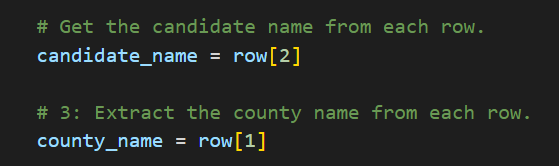

# Election_Analysis

## Project Overview
A Colorado Board of Elections employee has given you the following tasks to complete the election audit of a recent local congressional election.

The purpose of this data analysis was to extract data from a .cvs file to:  
  1) Calculate the total number of votes cast
  2) Get a complete list of candidates who recevied votes
  3) Calculate the total number of votes each candidate received
  4) Calculate the percentage of votes each candidate won
  5) Determine the winner of the election based on popular vote
  6) Get a complete list of counties that voted
  7) Calculate total vote count for each county and percentage of total votes in each county
  8) Determine the county with the largest voter turnout
 
## Election-Audit Results
The analysis of the election show that:
 - There were 369,711 votes cast in the election
 - The candidates were:
    - Charles Casper Stockham
    - Diana DeGette
    - Raymon Anthony Doane
 - The candidate results were:
    - Charles Casper Stockham received 23.0% of the vote and 85,123 number of votes
    - Diana DeGette received 73.8% of the vote and 272,892 number of votes
    - Raymon Anthony Doane received 3.1% of the vote and 11,606 number of votes
 - The winner of the election was:
    - Diana DeGette, who receive 73.8% of the vote and 272,892 number of votes
 - The counties that voted were:
    - Jefferson
    - Denver
    - Arapahoe
 - The county results for voter turnout were:
    - 38, 855 number of votes or 10.5% of the vote came from Jefferson county
    - 306,055 number of votes or 82.8% of the vote came from Denver county
    - 24,801 number of votes or 6.7% of the vote came from Arapahoe county
 - The county with the largest voter turnout was:
    - Denver had the largest voter turnout with 82.8% of the vote and 306,055 number of votes

## Election-Audit Summary
This script can be used for any election, the only item that might need to be changed is the row number to extract the candidate and county name.

